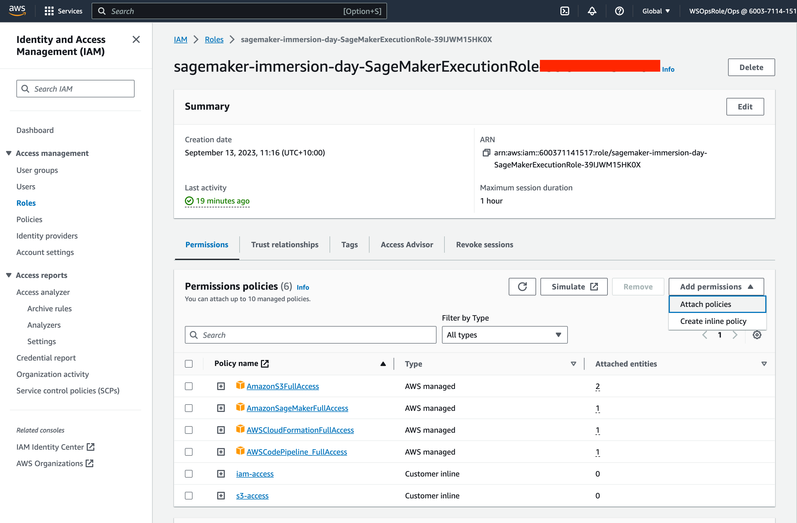
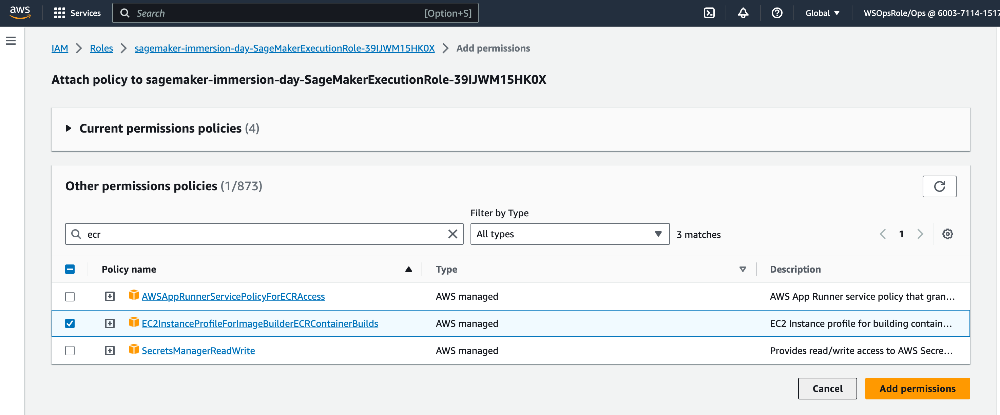
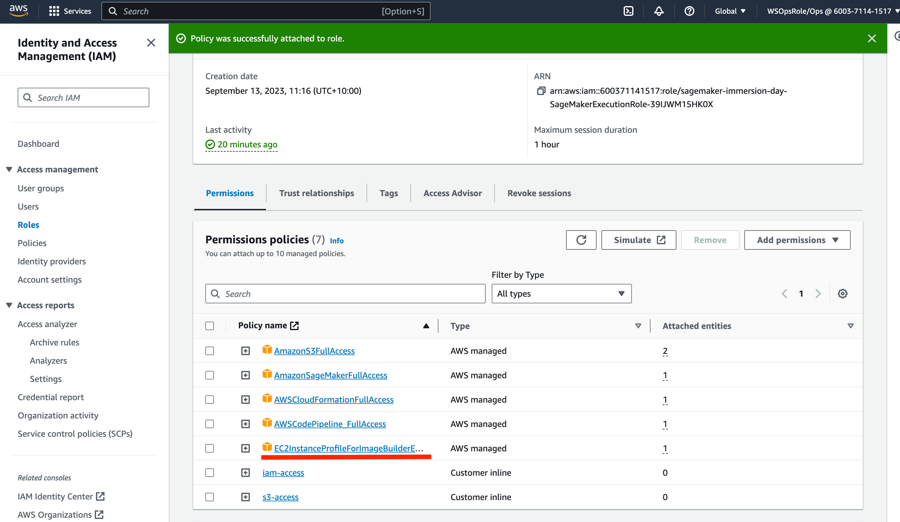

# Update on SageMaker Execution Role

In case the existing SageMaker Execution role (sagemaker-immersion-day-SageMakerExecutionRole-#####) doesn't include ECR permissions, please kindly follow the below step to update it.

## Steps

1. Open [IAM console](https://us-east-1.console.aws.amazon.com/iamv2/home#/home).
2. Select [Roles](https://us-east-1.console.aws.amazon.com/iamv2/home#/roles) in the left-hand side manu
3. Type "sagemaker-immersion-day-SageMakerExecutionRole" in Search box
4. Click "sagemaker-immersion-day-SageMakerExecutionRole-####" role from the search result
5. Attach policies
  
6. Search IAM policy with 'ecr' & select "EC2InstanceProfileForImageBuilderECRContainerBuilds" 
  
7. Add permission
  